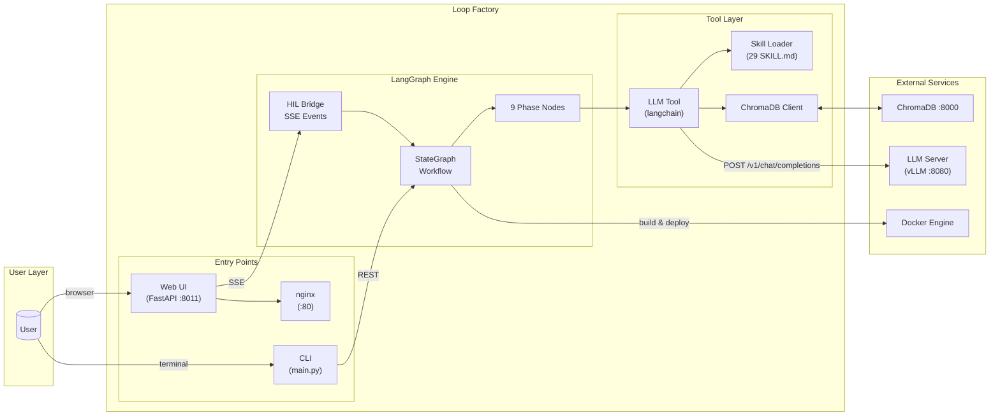
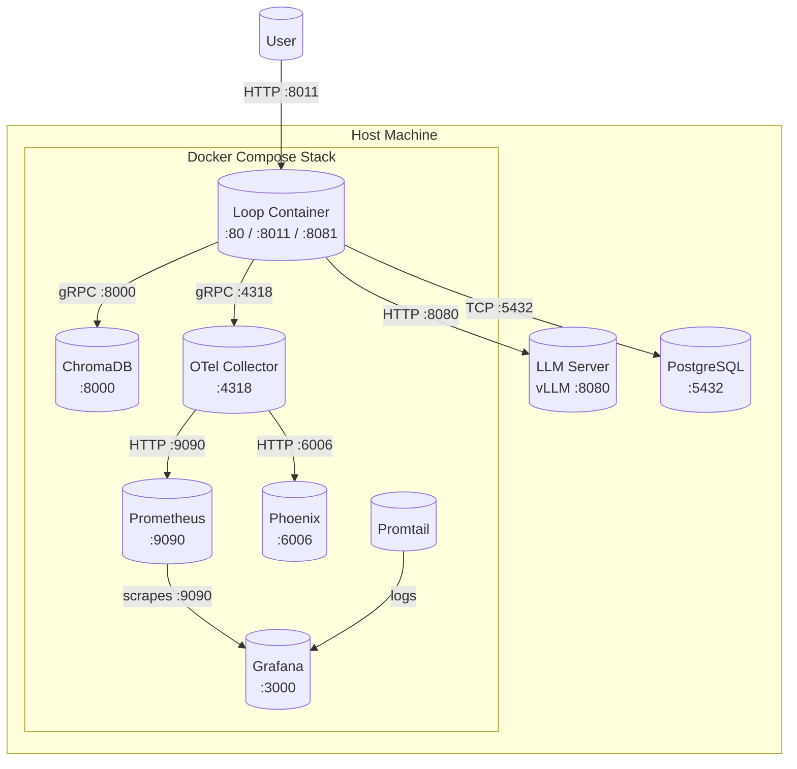

# Loop Factory

AI agent-driven loop-engineering factory to produce software products with minimal human intervention.

Self-improving AI-driven software development engine built on LangGraph.

```
DISCOVER → DEFINE → PLAN → ARCH_REVIEW → BUILD → SEED_DATA → VERIFY → SHIP → REFLECT
```


Each cycle runs through these phases with quality gates, HIL (Human-in-the-Loop) review gates, and self-improvement via ChromaDB pattern storage. CLI and Web UI share the same `WorkflowRunner` — identical node execution, different UX layers.

---

## Architecture

### Container Architecture



### Deployment Architecture



### Component Overview

| Component | Responsibility | Config Key |
|-----------|---------------|------------|
| `main.py` | CLI entry — headless auto-approve | `workflow.auto_approve` |
| `api/app.py` | FastAPI backend — HIL mode via REST | `services.loop_api.*` |
| `frontend/backend/workflow_bridge.py` | SSE event bridge + HIL interrupt handling | `services.product.*` |
| `graph/main.py` | LangGraph StateGraph definition | `workflow.hil_mode` |
| `graph/nodes/*.py` | Phase node implementations (9 nodes) | `paths.*` |
| `tools/llm.py` | LLM call dispatch with retry & context compression | `services.llm.*` |
| `tools/loader.py` | Skill registry discovery & hot-reload | `workflow.skill_registry_path` |
| `feedback/chroma_client.py` | ChromaDB pattern storage/retrieval | `services.chroma.*` |
| `service/otel_instrumentor.py` | OpenTelemetry trace export | `services.otel.*` |
| `service/health.py` | Health check server + dependency verification | `services.observability.*` |
| `config/loader.py` | Three-tier config: `ENV > YAML > default` | N/A (meta) |

---

## Skills Per Workflow State

Each workflow phase chains specialized skills from `skills/` (29 registered). Skills are `SKILL.md` files — context templates that the LLM follows to produce specific outputs. A missing skill is silently skipped.

### Phase-Specific Skill Chains

| Phase | Skills Chained | Purpose |
|-------|----------------|---------|
| **DISCOVER** | `interview-me` → `coding-principles` | HIL interview (9 structured questions). Scans existing codebases for context. Generates `requirement.md`. Auto-generates defaults in auto-approve mode. |
| **DEFINE** | `speckit-specify` → `api-and-interface-design` | Generates structured specification + API contract. Incorporates user review feedback if returning from ARCH_REVIEW rejection. |
| **PLAN** | `writing-plans` → `speckit-tasks` → `speckit-analyze` → `doubt-driven-development` → `speckit-checklist` → `architecture-diagram-generator` | Task breakdown, architecture planning, doubt resolution, and diagram generation. Outputs `plan.md` + `diagrams.md`. |
| **ARCH_REVIEW** | _(human gate — no skills called)_ | User reviews spec, plan, and Mermaid diagrams. Approve → BUILD, Reject → DEFINE. Max 2 retries. |
| **BUILD** | `incremental-implementation` → `test-driven-development` (per task) → `security-and-hardening` → `requesting-code-review` → `docker-compose-deployment` | Per-task code generation with TDD. Aggregate passes: STRIDE security model, code review. Docker build + health check + pytest. |
| **SEED_DATA** | `ai-workflow-data-seeding` | Test data generation. Executes seed scripts inside Docker containers. |
| **VERIFY** | `uat-workflow` → `performance-optimization` → `systematic-debugging` → `code-simplification` | Playwright UAT (mandatory). Conditional: performance profiling if P95 > 500ms, debugging if flakiness > 10%, simplification if review revisions > threshold. |
| **SHIP** | `observability-and-instrumentation` → `shipping-and-launch` → `docker-compose-deployment` → `git-workflow` | Deployment packaging: observability setup, launch checklist, Docker deployment, version tagging. |
| **REFLECT** | Internal `diff_engine` → `context-pruning` → `git-workflow` | Cycle analysis: aggregates metrics, queries ChromaDB patterns, generates config/guardrail diff proposals. Human approval gate for changes. |

### Local Skills Registry

```
skills/
├── ai-workflow-data-seeding/SKILL.md
├── api-and-interface-design/SKILL.md
├── architecture-diagram-generator/SKILL.md
├── coding-principles/SKILL.md
├── code-simplification/SKILL.md
├── context-pruning/SKILL.md
├── context-size-manager/SKILL.md
├── docker-compose-deployment/SKILL.md
├── doubt-driven-development/SKILL.md
├── fastapi-jinja2-feature-build/SKILL.md
├── git-workflow/SKILL.md
├── headroom-context-compression/SKILL.md
├── incremental-implementation/SKILL.md
├── interview-me/SKILL.md
├── observability-and-instrumentation/SKILL.md
├── performance-optimization/SKILL.md
├── requesting-code-review/SKILL.md
├── security-and-hardening/SKILL.md
├── shipping-and-launch/SKILL.md
├── speckit-analyze/SKILL.md
├── speckit-checklist/SKILL.md
├── speckit-specify/SKILL.md
├── speckit-tasks/SKILL.md
├── systematic-debugging/SKILL.md
├── test-driven-development/SKILL.md
├── uat-workflow/SKILL.md
└── writing-plans/SKILL.md
```

**Total per cycle**: ~20–35 LLM calls. BUILD loops (up to 2 retries) can increase this.

---

## How to Run It Locally

### Prerequisites

- **Docker** + **Docker Compose** (v2.20+)
- **LLM endpoint** (OpenAI-compatible, e.g., vLLM Qwen3.6-27B on `:8080`)

### Configuration

All external parameters are centralized in `config/config.yaml`. Override via environment variables or direct YAML edits:

```bash
# Quick override — no code changes needed
export LLM_BASE_URL="http://host.docker.internal:8080/v1"
export LLM_MODEL="Qwen3.6-27B"
export LOG_LEVEL="info"
```

Or edit `config/config.yaml` directly:

```yaml
services:
  llm:
    base_url: http://host.docker.internal:8080/v1
    model: Qwen3.6-27B
    temperature: 0.1
    max_tokens: 32768

observability:
  log_level: info
  port: 8081
```

### Option A: CLI (Headless, Auto-Approve)

Runs the full pipeline without human intervention. DISCOVER generates default interview notes from the spec.

```bash
# Build and start (no bind mounts — uses Docker volume for output)
docker compose up -d --build loop

# Monitor logs
docker compose logs -f loop

# Access the health endpoint
curl http://localhost:8081/health
```

### Option B: Web UI (Human-in-the-Loop)

Interactive mode with SSE event streaming, quality gates dashboard, and diagram rendering.

```bash
# Start the stack
docker compose up -d --build loop

# Open the UI
# Frontend: http://localhost (nginx :80)
# API: http://localhost:8011
# Health: http://localhost:8081
```

### Docker Stack Services

| Service | Port | Purpose |
|---------|------|---------|
| `loop` | :80 | nginx — static frontend |
| `loop` | :8011 | FastAPI backend — workflow API |
| `loop` | :8081 | Health check server |
| `chromadb` | :8000 (internal) | Pattern storage |
| `otel-collector` | :4318 | OpenTelemetry trace collection |
| `phoenix` | :6006 | Trace visualization (OpenLIT) |
| `prometheus` | :9090 | Metrics scraping |
| `grafana` | :3000 | Observability dashboards |
| `promtail` | _(internal)_ | Log aggregation |

### Stopping & Restarting

```bash
# Stop everything
docker compose down

# Rebuild without cache (after code changes)
docker compose build --no-cache loop
docker compose up -d loop

# Full restart (preserves volumes)
docker compose stop
docker compose rm -f
docker compose up -d --build
```

> ⚠️ **Token Usage**: A full cycle makes 20–35 LLM calls. Monitor your provider's usage dashboard during long runs.

---

## Key Components

- **Entry Points**: CLI (`main.py`) for headless auto-approve, or Web UI (FastAPI `:8011`) for HIL workflow
- **LangGraph Engine**: `StateGraph` with 9 phase nodes, conditional routing via quality gates, OOTB `interrupt_after` for HIL pauses
- **Skills System**: 29 `SKILL.md` files loaded by `tools/loader.py`, invoked via `tools/llm.py` with context optimization
- **HIL Bridge**: SSE event streaming between LangGraph executor and frontend; supports double-pause DISCOVER interview and ARCH_REVIEW diagram approval
- **Feedback Loop**: ChromaDB stores historical patterns across cycles; REFLECT phase queries and generates config diff proposals
- **Deployment**: Single Docker Compose stack (`loop` container = orchestrator + frontend + nginx)

---

## Configuration

Three-tier priority: **Environment Variables** > **`config/config.yaml`** > **Built-in Defaults**.

All external parameters are centralized — zero hardcoded URLs, ports, or paths in production code.

```yaml
paths:
  project_name: test_discover_fix
  workspace_dir: ./output
  skills_dir: skills
  storage_dir: ./storage
  guardrails_path: ./config/guardrails.yaml

services:
  llm:
    base_url: http://host.docker.internal:8080/v1
    model: Qwen3.6-27B
  chroma:
    url: http://chromadb:8000
  loop_api:
    url: http://localhost:8011
  product:
    url: http://localhost:8010

workflow:
  hil_mode: auto
  max_retries: 2
  auto_approve: false
```

---

## Dependencies

```
langgraph, langchain-core, langgraph-checkpoint, langgraph-sdk
pydantic, pyyaml, httpx, aiohttp
chromadb (pattern storage)
opentelemetry-api, opentelemetry-sdk (observability)
uvicorn, fastapi (web UI)
```

Install: baked into Docker image via `docker compose up -d --build`.

---

## Guardrails

Security-sensitive keywords (`auth`, `payment`, `billing`, `credential`, `secret`, `api_key`, `token`, etc.) trigger human approval. See `config/guardrails.yaml` for full thresholds and feedback rules.

Quality thresholds enforced per phase:

| Threshold | Default | Phase |
|---|---|---|
| `min_spec_confidence` | ≥ 0.9 | DEFINE |
| `max_arch_uncertainty` | ≤ 0.8 | PLAN |
| `max_security_findings` | 0 | BUILD |
| `max_review_revisions` | ≤ 2 | BUILD |
| `min_uat_pass_rate` | ≥ 0.95 | VERIFY |
| `max_latency_ms` | ≤ 500 | VERIFY (perf) |
| `max_test_flakiness_rate` | ≤ 0.1 | VERIFY (debug) |