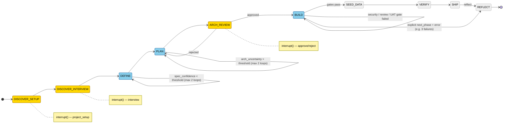
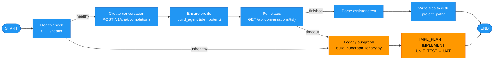
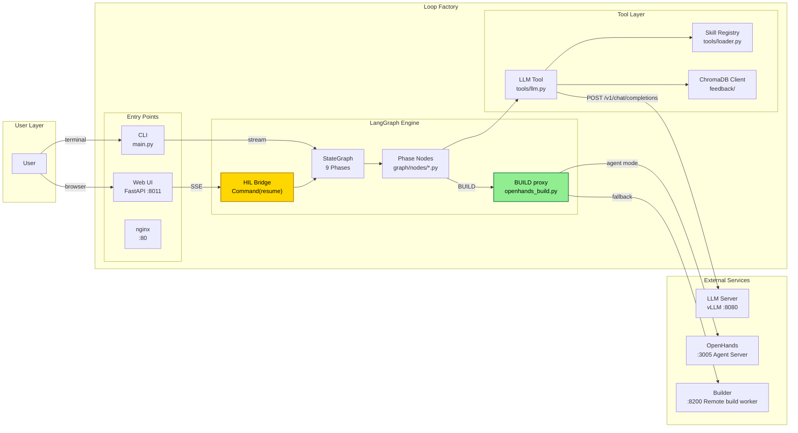
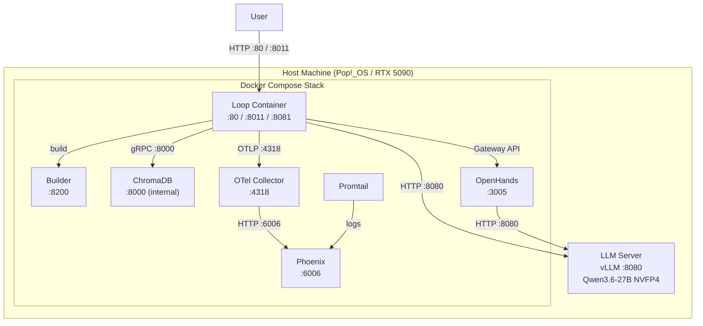

# Loop Factory

Self-improving AI-driven software development engine built on LangGraph.

> **Pipeline**: `DISCOVER → DEFINE → PLAN → ARCH_REVIEW → BUILD → SEED_DATA → VERIFY → SHIP → REFLECT`

Each cycle runs through 9 logical phases mapped to 12 graph nodes with quality gates, Human-in-the-Loop review, and self-improvement via ChromaDB pattern storage. CLI (`main.py`) and Web UI (FastAPI `:8011`) share the same `WorkflowRunner` — identical node execution, different UX layers. DISCOVER is split into two nodes (`DISCOVER_SETUP` + `DISCOVER_INTERVIEW`), each with one `interrupt()` call, so resume only re-runs ~30 lines instead of the full ~100-line discovery node.

---

## Workflow State Machine


```mermaid
stateDiagram-v2
    direction LR

    [*] --> DISCOVER_SETUP

    %% DISCOVER split: two nodes, each with ONE interrupt() (graph/main.py)
    DISCOVER_SETUP --> DISCOVER_INTERVIEW
    DISCOVER_INTERVIEW --> DEFINE

    %% Fixed forward edges
    DEFINE --> PLAN
    PLAN --> ARCH_REVIEW
    SEED_DATA --> VERIFY

    %% Conditional edges (graph/edges.py route_phase)
    ARCH_REVIEW --> BUILD : approved
    ARCH_REVIEW --> PLAN : rejected

    BUILD --> SEED_DATA : gates pass
    BUILD --> BUILD : security / review / UAT gate failed
    BUILD --> REFLECT : explicit next_phase + error (e.g. 3 failures)

    VERIFY --> SHIP

    %% Conditional: route_phase
    SHIP --> REFLECT : reflect
    REFLECT --> [*]

    %% Self-loops (quality gates)
    DEFINE --> DEFINE : spec_confidence < threshold (max 2 loops)
    PLAN --> PLAN : arch_uncertainty > threshold (max 2 loops)

    %% HIL interrupt points — OOTB interrupt() + Command(resume=...)
    note right of DISCOVER_SETUP : interrupt() — project_setup
    note right of DISCOVER_INTERVIEW : interrupt() — interview
    note right of ARCH_REVIEW : interrupt() — approve/reject

    classDef hil fill:#FFD700,stroke:#B8860B,stroke-width:2px,color:#000
    classDef gate fill:#87CEEB,stroke:#4682B4,stroke-width:2px,color:#000
    classDef normal fill:#F0F0F0,stroke:#999,stroke-width:1px,color:#000
    class DISCOVER_SETUP,DISCOVER_INTERVIEW,ARCH_REVIEW hil
    class DEFINE,PLAN,BUILD gate
    class SEED_DATA,VERIFY,SHIP,REFLECT normal
```

### Actual Graph Nodes (`graph/main.py`)

| Node | Phase | Interrupt? | Conditional? |
|---|---|---|---|
| `DISCOVER_SETUP` | DISCOVER | `interrupt()` — project_setup | No |
| `DISCOVER_INTERVIEW` | DISCOVER | `interrupt()` — interview | No |
| `DEFINE` | DEFINE | No | No |
| `PLAN` | PLAN | No | No |
| `ARCH_REVIEW` | ARCH_REVIEW | `interrupt()` — approve/reject | Yes (`route_phase`) |
| `BUILD` | BUILD | No (OpenHands proxy) | Yes (`route_phase`) |
| `SEED_DATA` | SEED_DATA | No | No |
| `VERIFY` | VERIFY | No | No |
| `SHIP` | SHIP | No | Yes (`route_phase`) |
| `REFLECT` | REFLECT | No | Yes (`route_phase`) |

DISCOVER is split into two nodes so resume only re-runs the paused node (~30 lines vs ~100). Each node has exactly one `interrupt()` call — LangGraph OOTB pattern with `Command(resume=...)`.

### Routing Logic

Quality thresholds from `config/guardrails.yaml` — REFLECT can update them between cycles:

| Phase | Gate | Threshold | On Failure |
|-------|------|-----------|------------|
| DEFINE | `spec_confidence` | ≥ 0.9 | Loop DEFINE (max 2) |
| PLAN | `arch_uncertainty` | ≤ 0.8 | Loop PLAN (max 2) |
| ARCH_REVIEW | `review_approved` | — | approve → BUILD, reject → PLAN |
| BUILD | `security_findings` | = 0 | Loop BUILD |
| BUILD | `review_revisions` | ≤ 2 | Loop BUILD |
| BUILD | `uat_pass_rate` | ≥ 0.95 | Loop BUILD |
| BUILD | `_build_fail_count` | ≥ 3 | Skip to REFLECT |
| SHIP | — | — | Always → REFLECT |
| REFLECT | — | — | END |

---

## BUILD Phase: Agent Delegation

The BUILD node delegates code generation to the OpenHands agent-server via the Gateway API (OpenAI-compatible). Falls back to the local legacy subgraph if unreachable.


```mermaid
graph LR
    START([START]) --> HEALTH["Health check<br/>GET /health"]

    HEALTH -->|healthy| CREATE["Create conversation<br/>POST /v1/chat/completions"]
    HEALTH -->|unhealthy| LEGACY["Legacy subgraph<br/>build_subgraph_legacy.py"]

    CREATE --> ENSURE["Ensure profile<br/>build_agent (idempotent)"]
    ENSURE --> POLL["Poll status<br/>GET /api/conversations/{id}"]
    POLL -->|finished| PARSE["Parse assistant text"]
    POLL -->|timeout| LEGACY

    PARSE --> WRITE["Write files to disk<br/>project_path/"]
    WRITE --> END([END])

    LEGACY --> SUB["IMPL_PLAN → IMPLEMENT<br/>UNIT_TEST → UAT"]
    SUB --> END

    classDef agent fill:#90EE90,stroke:#2E8B57,stroke-width:2px,color:#000
    classDef fallback fill:#FF9800,stroke:#E65100,stroke-width:1px,color:#000
    classDef node fill:#2196F3,stroke:#1565C0,stroke-width:1px,color:#fff
    class HEALTH,ENSURE,POLL,PARSE,WRITE node
    class CREATE node
    class LEGACY,SUB fallback
```

| Step | Implementation | Details |
|------|---------------|---------|
| Health check | `GET /health` | Falls back to legacy on any failure |
| Ensure profile | `POST /api/profiles` | Idempotent — 409 = already exists |
| Create conversation | `POST /v1/chat/completions` | `openhands_build_agent` model profile |
| Poll | `GET /api/conversations/{id}` | 5s interval, 1h timeout |
| Parse | Regex → file blocks + test results | Derives `build_status`: pass/partial/fail |
| Write files | Disk I/O to `project_path` | Downstream phases read from disk |
| Legacy fallback | `build_subgraph_legacy.py` | Full IMPL_PLAN → IMPLEMENT → UNIT_TEST → UAT pipeline |

---

## Architecture

### Container Architecture


```mermaid
graph LR
    subgraph User["User Layer"]
        U["User"]
    end

    subgraph LoopFactory["Loop Factory"]
        subgraph Entry["Entry Points"]
            CLI["CLI<br/>main.py"]
            WebUI["Web UI<br/>FastAPI :8011"]
            Nginx["nginx<br/>:80"]
        end

        subgraph Engine["LangGraph Engine"]
            Graph["StateGraph<br/>9 Phases"]
            Nodes["Phase Nodes<br/>graph/nodes/*.py"]
            Bridge["HIL Bridge<br/>Command(resume)"]
            BuildProxy["BUILD proxy<br/>openhands_build.py"]
        end

        subgraph Tools["Tool Layer"]
            LLM["LLM Tool<br/>tools/llm.py"]
            Skills["Skill Registry<br/>tools/loader.py"]
            ChromaC["ChromaDB Client<br/>feedback/"]
        end
    end

    subgraph External["External Services"]
        LLM_Srv["LLM Server<br/>vLLM :8080"]
        OpenHands["OpenHands<br/>:3005 Agent Server"]
        Builder["Builder<br/>:8200 Remote build worker"]
    end

    U -->|browser| WebUI
    U -->|terminal| CLI
    CLI -->|stream| Graph
    WebUI -->|SSE| Bridge
    Bridge --> Graph
    Graph --> Nodes
    Nodes --> LLM
    LLM --> Skills
    LLM --> ChromaC
    LLM -->|"POST /v1/chat/completions"| LLM_Srv
    Nodes -->|"BUILD"| BuildProxy
    BuildProxy -->|"agent mode"| OpenHands
    BuildProxy -->|"fallback"| Builder

    classDef hil fill:#FFD700,stroke:#B8860B,stroke-width:2px,color:#000
    classDef agent fill:#90EE90,stroke:#2E8B57,stroke-width:2px,color:#000
    class BuildProxy agent
    class Bridge hil
```

### Deployment Architecture


```mermaid
graph TB
    U["User"]

    subgraph Host["Host Machine (Pop!_OS / RTX 5090)"]
        LLM_C["LLM Server<br/>vLLM :8080<br/>Qwen3.6-27B NVFP4"]

        subgraph DockerStack["Docker Compose Stack"]
            LC["Loop Container<br/>:80 / :8011 / :8081"]
            BLD["Builder<br/>:8200"]
            CC["ChromaDB<br/>:8000 (internal)"]
            OC["OTel Collector<br/>:4318"]
            PH["Phoenix<br/>:6006"]
            OH["OpenHands<br/>:3005"]
            PT["Promtail"]
        end
    end

    U -->|"HTTP :80 / :8011"| LC
    LC -->|"gRPC :8000"| CC
    LC -->|"OTLP :4318"| OC
    LC -->|"HTTP :8080"| LLM_C
    LC -->|"Gateway API"| OH
    LC -->|"build"| BLD
    OH -->|"HTTP :8080"| LLM_C
    OC -->|"HTTP :6006"| PH
    PT -->|"logs"| PH
```

---

## Key Components

| Component | Path | Responsibility |
|-----------|------|----------------|
| CLI entry | `main.py` | Headless auto-approve mode |
| FastAPI backend | `api/app.py` | HIL mode via REST + WebSocket |
| API routes | `api/routes.py` | `/workflow/*`, `/ws/*`, approvals |
| Workflow service | `api/services.py` | Orchestrates graph execution |
| LangGraph state | `graph/state.py` | TypedDict with 22+ fields, CycleMetrics |
| Graph builder | `graph/main.py` | StateGraph with 9 nodes + conditional edges |
| Edge routing | `graph/edges.py` | `route_phase()` quality gates from guardrails |
| Shared executor | `graph/executor.py` | CLI + Web shared: stream, HIL, eval hooks |
| OpenHands BUILD | `graph/nodes/openhands_build.py` | Agent delegation with legacy fallback |
| BUILD proxy | `graph/nodes/build_proxy.py` | Remote builder HTTP proxy |
| Legacy BUILD | `graph/nodes/build_subgraph_legacy.py` | Full subgraph fallback |
| Skill loader | `tools/loader.py` | Registry discovery + hot-reload |
| LLM tool | `tools/llm.py` | Distill + invoke via LangChain OpenAI |
| Skill distiller | `tools/distiller.py` | Compress SKILL.md to Purpose + Process |
| Context manager | `tools/context_manager.py` | Token-aware context preparation |
| Evaluator | `service/evaluator.py` | LLM-as-judge: 5 evaluators → OTel → Phoenix |
| OTel instrumentor | `service/otel_instrumentor.py` | Trace export with phase timing |
| Health server | `service/health.py` | Health endpoint + phase tracking |
| Guardrails | `config/guardrails.yaml` | Quality thresholds + security keywords |
| Bounds | `config/bounds.yaml` | Context size, artifact, and build limits |

---

## Skills Registry (21 skills)

Skills are `SKILL.md` files in `skills/` — context templates the LLM follows per phase. Loaded lazily by `tools/loader.py`; missing skills silently skipped.

```
skills/
├── ai-workflow-data-seeding/SKILL.md       # SEED_DATA phase
├── api-and-interface-design/SKILL.md        # DEFINE phase
├── architecture-diagram-generator/SKILL.md  # PLAN phase
├── code-simplification/SKILL.md            # Standalone (future VERIFY)
├── coding-principles/SKILL.md              # DISCOVER phase
├── docker-compose-deployment/SKILL.md      # Standalone (local dev reference)
├── doubt-driven-development/SKILL.md       # PLAN phase
├── git-workflow/SKILL.md                   # SHIP + REFLECT phases
├── incremental-implementation/SKILL.md     # BUILD phase
├── interview-me/SKILL.md                   # DISCOVER phase
├── observability-and-instrumentation/SKILL.md # SHIP phase
├── performance-optimization/SKILL.md       # Standalone (future VERIFY)
├── production-deployment/SKILL.md         # SHIP phase
├── requesting-code-review/SKILL.md        # BUILD phase (SECURITY_GATE)
├── security-and-hardening/SKILL.md        # BUILD phase (SECURITY_GATE)
├── shipping-and-launch/SKILL.md            # SHIP phase
├── systematic-debugging/SKILL.md          # Standalone (future VERIFY)
├── test-driven-development/SKILL.md       # BUILD phase
├── uat-workflow/SKILL.md                   # BUILD phase (fallback)
└── writing-plans/SKILL.md                  # DEFINE + PLAN phases
```

**Total per cycle**: ~20–35 LLM calls. BUILD loops (up to 2 retries) increase this.

---

## Evaluation

At phase-completion, `service/evaluator.py` runs LLM-as-judge (Qwen3.6-27B) on phase outputs. Context-aware — extracts project domain from spec before scoring. Results stream to Phoenix UI (`:6006`) via OTel span attributes. Non-blocking: eval failures never stop the workflow (~3s per phase).

### Evaluators

| Evaluator | Phase | Dimensions |
|---|---|---|
| `spec_quality` | DISCOVER | `domain_fit`, `clarity`, `completeness`, `consistency`, `actionability` |
| `plan_score` | PLAN | `coverage`, `actionability`, `architecture`, `risk`, `domain_fit` |
| `review_score` | ARCH_REVIEW | `thoroughness`, `specificity`, `actionability`, `severity`, `domain_fit` |
| `build_quality` | BUILD | `code_quality`, `test_coverage`, `security`, `performance`, `maintainability` |
| `ship_quality` | SHIP | `config_completeness`, `secret_safety`, `resilience`, `observability`, `deployment_automation` |

### How It Works

1. Phase completes → `_run_phase_eval()` in `graph/executor.py`
2. Evaluator sends context + output to LLM
3. LLM returns scores (0.0–1.0) with rationale
4. Results attached as OTel span attributes → Phoenix UI at `:6006`

---

## Guardrails

Security-sensitive keywords (`auth`, `payment`, `billing`, `credential`, `secret`, `api_key`, `token`, etc.) trigger human approval. See `config/guardrails.yaml`.

Quality thresholds (from `config/guardrails.yaml`):

| Threshold | Default | Phase |
|---|---|---|
| `min_spec_confidence` | ≥ 0.9 | DEFINE |
| `max_arch_uncertainty` | ≤ 0.8 | PLAN |
| `max_security_findings` | 0 | BUILD |
| `max_review_revisions` | ≤ 2 | BUILD |
| `uat_pass_rate` | ≥ 0.95 | VERIFY |
| `max_latency_ms` | ≤ 500 | VERIFY (perf) |
| `max_test_flakiness_rate` | ≤ 0.1 | VERIFY (debug) |

Context/artifact bounds (`config/bounds.yaml`):
- `define_max_tokens`: 32768, `plan_max_tokens`: 24576
- `max_generated_code_entries`: 3, `max_feedback_entries`: 20
- `max_item_retries`: 3, `max_build_failures`: 3
- `max_chroma_patterns`: 3

---

## How to Run It Locally

### Prerequisites

- **Docker** + **Docker Compose** (v2.20+)
- **LLM endpoint** (OpenAI-compatible, e.g., vLLM Qwen3.6-27B on `:8080`)

### Configuration

All external parameters centralized in `config/config.yaml`. Override via environment variables or YAML:

```bash
# Quick override — no code changes needed
export LLM_BASE_URL="http://host.docker.internal:8080/v1"
export LLM_MODEL="Qwen3.6-27B"
export LOG_LEVEL="info"
```

### Option A: CLI (Headless, Auto-Approve)

```bash
# Build and start
docker compose up -d --build loop

# Monitor logs
docker compose logs -f loop

# Health check
curl http://localhost:8081/health
```

### Option B: Web UI (Human-in-the-Loop)

```bash
# Start the stack
docker compose up -d --build loop

# Open the UI
# Frontend: http://localhost (nginx :80)
# API: http://localhost:8011
# Health: http://localhost:8081
```

### Docker Stack Services

| Service | Port | Purpose |
|---------|------|---------|
| `loop` | :80 | nginx — static frontend |
| `loop` | :8011 | FastAPI backend — workflow API |
| `loop` | :8081 | Health check server |
| `builder` | :8200 | Remote BUILD phase worker |
| `chromadb` | :8000 (internal) | Pattern storage |
| `otel-collector` | :4318 | OpenTelemetry trace collection |
| `phoenix` | :6006 | Trace visualization + LLM eval UI |
| `openhands` | :3005 | OpenHands Agent Server |
| `promtail` | _(internal)_ | Log aggregation → Loki |

### Stopping & Restarting

```bash
# Stop
docker compose down

# Rebuild (after code changes)
docker compose build --no-cache loop
docker compose up -d loop

# Full restart (preserves volumes)
docker compose stop
docker compose rm -f
docker compose up -d --build
```

> ⚠️ **Token Usage**: A full cycle makes 20–35 LLM calls. Monitor your provider's usage dashboard during long runs.

---

## Configuration

Three-tier priority: **Environment Variables** > **`config/config.yaml`** > **Built-in Defaults**.

```yaml
paths:
  project_name: test_discover_fix
  workspace_dir: ./output
  skills_dir: skills
  storage_dir: ./storage
  guardrails_path: ./config/guardrails.yaml

services:
  llm:
    base_url: http://host.docker.internal:8080/v1
    model: Qwen3.6-27B
  chroma:
    url: http://chromadb:8000
  loop_api:
    url: http://localhost:8011

workflow:
  hil_mode: auto
  max_retries: 2
  auto_approve: false

superweb:
  mode: agent
  openhands_url: http://openhands:8000
  openhands_port: 3005
  agent_conversations: 3
  agent_timeout_seconds: 3600
```

---

## Dependencies

```
# Core
langgraph>=1.2.0, langchain-core>=1.4.0, langchain-openai>=1.0.0
langgraph-checkpoint>=4.1.0, pydantic>=2.13.0, pyyaml>=6.0
typer>=0.25.0, rich>=13.0

# Pattern storage
chromadb>=0.6.0

# UAT / Testing
playwright>=1.0.0, httpx>=0.28.0

# Observability
opentelemetry-sdk, opentelemetry-exporter-otlp-proto-http
opentelemetry-instrumentation-requests, opentelemetry-instrumentation-asyncio
arize-phoenix, prometheus-client

# Web UI
fastapi, uvicorn[standard]

# Checkpoint persistence
msgpack>=1.0.0
```

Install: baked into Docker image via `docker compose up -d --build`.

---

## API Endpoints

| Method | Path | Description |
|--------|------|-------------|
| POST | `/workflow/start` | Start workflow. Body: `{project_name, spec, context_folder, auto_approve?}`. `auto_approve` (optional bool) overrides config default. |
| GET | `/workflow/status` | Get current status |
| POST | `/workflow/approval` | Submit HIL approval |
| POST | `/workflow/input` | Submit user input |
| GET | `/workflow/input/pending` | List pending inputs |
| POST | `/workflow/cancel` | Cancel workflow |
| GET | `/workflow/diagrams` | Get architecture diagrams |
| POST | `/workflow/diagrams/review` | Review diagrams |
| WS | `/ws/{workflow_id}` | Real-time WebSocket stream |

---

## Recent Changes

- **Web UI auto_approve override** — `StartRequest.auto_approve` (Optional[bool]) lets UI clients override config default; defaults to `config.yaml` when `None`
- **DISCOVER auto_approve null-safety** — `auto_approve_override=None` now correctly falls back to config instead of being treated as falsy
- **REFLECT explicit routing** — `route_phase()` handles REFLECT → END explicitly; reflect_node clears `error` on success
- **fabric-prompts skill key fix** — Discovery node loads `fabric-prompts` skill (was `fabric-prompt-engineering`)
- **LangGraph 1.2+ conformance** — Removed `audit_entries` from `WorkflowState` (OOM risk), verified all `invoke_skill()` calls use `prepare_context_for_llm()`, confirmed `interrupt()` OOTB pattern, `Command(resume=...)` resume, custom `SqliteSaver` with `dumps_typed()` API
- **Lazy skill registry** — `tools/loader.py` hot-reload; removed ~49K token overhead from WorkflowState init
- **Context bounds cleanup** — Removed dead `build_max_tokens`, `superweb`, `memory_budget`, `subgraph` entries from `bounds.yaml`
- **OpenHands BUILD** — Agent delegation via Gateway API with legacy subgraph fallback
- **Context optimization** — `tools/distiller.py` + `tools/context_manager.py` for token-efficient skill invocation