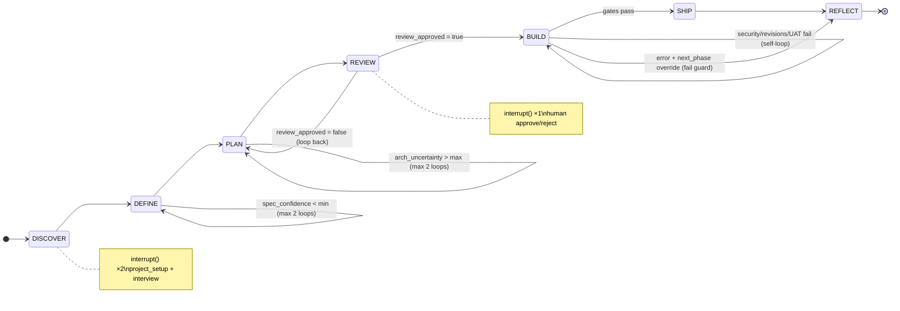

```mermaid
stateDiagram-v2
    direction LR

    [*] --> DISCOVER

    %% === Fixed forward edges ===
    DISCOVER --> DEFINE
    DEFINE --> PLAN
    PLAN --> REVIEW
    SHIP --> REFLECT
    REFLECT --> [*]

    %% === Conditional edges ===
    REVIEW --> BUILD : review_approved = true
    REVIEW --> PLAN : review_approved = false (loop back)

    BUILD --> SHIP : gates pass
    BUILD --> BUILD : security/revisions/UAT fail (self-loop)
    BUILD --> REFLECT : error + next_phase override (fail guard)

    %% === Self-loops (quality gates) ===
    DEFINE --> DEFINE : spec_confidence < min (max 2 loops)
    PLAN --> PLAN : arch_uncertainty > max (max 2 loops)

    note right of DISCOVER : interrupt() ×2\nproject_setup + interview
    note right of REVIEW : interrupt() ×1\nhuman approve/reject
```