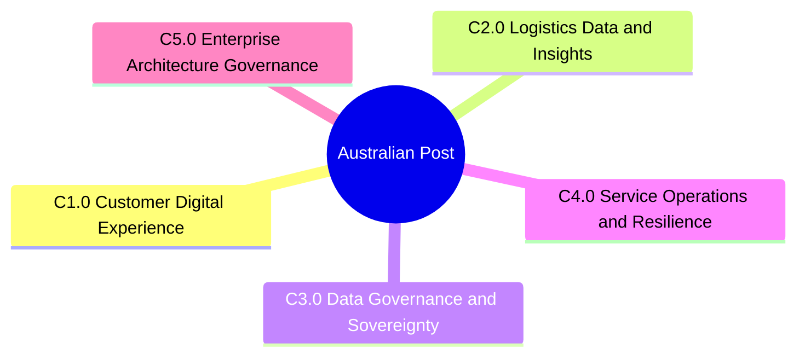
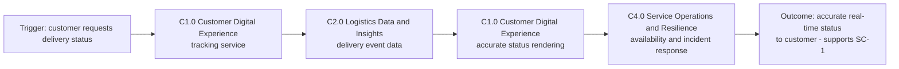
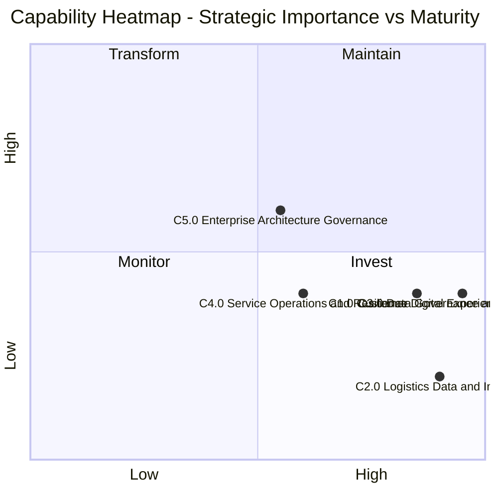

# Business Capability Map

## Document Control

| Field | Value |
|-------|-------|
| Document ID | `ARC-001-BPCM-v1.0` |
| Document Type | BPCM (Business Capability Map, TOGAF ADM Phase A) |
| Project | Australian Post Digital Transformation |
| Owner | Terry Nguyen, Enterprise Architect |
| Classification | OFFICIAL |
| Status | DRAFT |
| Version | 1.0 |
| Created | 2026-09-02 |
| Last Modified | 2026-09-02 |
| Review Cycle | Monthly during active ADM cycle |
| Next Review Date | 2026-10-02 |
| Reviewed By | CISO, Australian Post |
| Approved By | Postmaster General |
| Distribution | Enterprise architecture board, CISO office, Customer Operations leadership, Group Executive sponsor |

### Revision History

| Version | Date | Author | Description | Reviewer | Approver |
|---------|------|--------|-------------|----------|----------|
| 1.0 | 2026-09-02 | ArcKit AI | Initial creation | CISO, Australian Post | Postmaster General |

---

## 0. Scope and Capability Depth

- **Capability depth: L1 (capability domains only)** — selected in the intake interview. Level 2
  sub-capabilities and Level 3 detailed capabilities are deliberately not modelled in this
  baseline; they can be introduced in a later ADM cycle or via `$arckit-gap-analysis` once
  capability owners validate the domains in §1.
- **Scope**: This map covers only the ADMP in-scope boundary (§2.1 of
  `ARC-001-ADMP-v1.0`): customer digital services, the AU-resident logistics and customer
  data platform, enterprise architecture governance and principles baseline, and the hybrid
  cloud + on-prem data residency model. Physical parcel routing and last-mile delivery
  operations, payroll/HR, and non-AU international operations remain **out of scope** and
  are intentionally absent from the hierarchy.
- **Business-led**: All capabilities describe *what* the enterprise does and the outcomes it
  delivers — not *how* (no technology choices). Maturity values are **assessed estimates**
  grounded in ADMP drivers and constraints; they must be validated with capability owners
  before the map is used for investment decisions.

---

## 1. Capability Hierarchy

### Level 1: Capability Domains

| Domain ID | Domain | Description | ADMP grounding |
|-----------|--------|-------------|----------------|
| C1.0 | Customer Digital Experience | Delivers the customer-facing digital services of parcel tracking, Q&A, logistics advisory, help and support, and feedback capture; converts delivery events into accurate, timely customer outcomes | §2.1 customer digital services; §3.1 defend market position; SC-1 |
| C2.0 | Logistics Data & Insights | Captures, reconciles, and transforms logistics and customer data into trusted data products and cost analytics; enables cost-per-delivery-event improvement and data-driven decisions | §2.1 logistics and customer data platform; §3.2 manual-reconciliation reduction; SC-2 |
| C3.0 | Data Governance & Sovereignty | Classifies, protects, and governs regulated customer data (PII) so it is processed only AU-resident; enforces privacy and prudential obligations (Privacy Act 1988 APPs, APP-11, APRA 2025) | §3.3 compliance drivers; §4 regulatory constraint; P-1; SC-3 |
| C4.0 | Service Operations & Resilience | Keeps digital services available, monitored, and recoverable across the hybrid and on-prem operating footprint; provides incident response and continuity within the 12-month cut-over and holiday-outage-freeze window | §4 timeline constraint; SC-4 availability > 99.9% |
| C5.0 | Enterprise Architecture Governance | Maintains the standing principles baseline (P-1..P-4), manages architecture decisions, and steers the transformation inside the FY 2025/26 $12M AUD engagement cap | §2.1 governance and principles baseline; §4 budget constraint; P-2/P-4 |

The five domains are MECE within the ADMP scope: customer-facing delivery (C1.0), the data
asset (C2.0), governance of that data (C3.0), operations of the services (C4.0), and
governance of the architecture itself (C5.0). No domain overlaps another and, together,
they cover every ADMP in-scope item.

### Level 2: Sub-Capabilities

Not modelled in v1.0 — capability depth was set to **L1 (domains only)** in the intake
interview. Sub-capabilities (3-8 per domain, `C{N}.{M}` numbering) will be defined in a
later ADM cycle or when gap analysis requires deeper granularity.

### Level 3: Detailed Capabilities

Not modelled in v1.0 — capability depth was set to **L1** in the intake interview. Detailed
capabilities (`C{N}.{M}.{K}` numbering) are deferred with Level 2.

### Capability Map (Mermaid mindmap)

---

## 2. Value Streams

### Value Stream Matrix

| Value Stream | Capabilities | Trigger | Outcome |
|--------------|--------------|---------|---------|
| VS-001 Parcel Lifecycle Tracking | C1.0, C2.0, C4.0 | Customer requests delivery status | Accurate, up-to-date status shown to the customer (supports SC-1, > 98% accuracy) |
| VS-002 Customer Q&A & Logistics Advisory | C1.0, C2.0, C4.0 | Customer asks a question or requests delivery advice | AI-assisted, accurate answer delivered within service level |
| VS-003 Delivery Data Optimisation | C2.0, C3.0, C4.0 | Delivery events are ingested into the AU-resident data platform | Reconciled, cost-optimised logistics data product (supports SC-2, -15% cost per delivery event) |
| VS-004 Customer Help & Support | C1.0, C4.0 | Customer experiences a delivery or service issue | Issue resolved via self-service or assisted support, customer retained |
| VS-005 Customer Feedback & Insights | C1.0, C2.0 | Customer feedback, surveys, and support interactions are captured | Actionable insights feed digital service and product improvement |

> Value streams are cross-cutting: a single capability (for example C1.0 Customer Digital
> Experience) participates in several value streams. This is modelled explicitly in the
> matrix rather than by duplicating capabilities.

### Value Stream Flow (VS-001 — Parcel Lifecycle Tracking)

### Capability Participation Note

C2.0 is the shared data spine: it serves VS-001, VS-002, VS-003, and VS-005. C4.0 wraps
every customer-facing stream with availability assurance. C3.0 governs all data movement
in VS-003 and VS-005, and C5.0 governs the design and evolution of all other capabilities.

---

## 3. Capability Maturity Assessment

**Maturity scale** (assessed, not a ranking — some capabilities are intentionally simple):

| Level | Name | Definition |
|-------|------|------------|
| L1 | Initial | Ad-hoc, undocumented, inconsistent |
| L2 | Managed | Documented, repeatable, locally managed |
| L3 | Defined | Standardised, integrated across the organisation |
| L4 | Quantitatively Managed | Measured, controlled, predictable |
| L5 | Optimising | Continuously improved, innovative, best-in-class |

### Maturity Table (at L1 domain level, per selected depth)

| Capability | Current (L1-L5) | Target (L1-L5) | Gap | Priority | Assessment basis (ADMP-grounded) |
|------------|----------------|---------------|-----|----------|----------------------------------|
| C1.0 Customer Digital Experience | L2 | L4 | 2 | High | Tracking exists but is batch-oriented and below the 98% accuracy target; Q&A/advisory is new and unproven (SC-1) |
| C2.0 Logistics Data & Insights | L1 | L4 | 3 | High | Manual reconciliation across fragmented legacy systems; no trusted cost analytics today (SC-2) |
| C3.0 Data Governance & Sovereignty | L2 | L4 | 2 | High | PII currently held in legacy systems; AU-residency and APP-11 controls not yet enforced or measured (SC-3) |
| C4.0 Service Operations & Resilience | L2 | L4 | 2 | Medium | On-prem manual operations; no measured 99.9% availability assurance (SC-4) |
| C5.0 Enterprise Architecture Governance | L3 | L4 | 1 | Medium | Principles baseline (ARC-000-PRIN-v1.0) is documented and standardised; measurement of decision compliance not yet in place |

> Current values are **estimates derived from ADMP drivers, constraints, and risks**
> (fragmented legacy IT, batch orientation, new compliance obligations). They are to be
> validated with capability owners — see Next Steps. Target values assume the end of the
> 12-month cut-over window.

---

## 4. Capability Heatmap

**Reading the chart** — x-axis is strategic importance (left = Low, right = High);
y-axis is current maturity (bottom = Low, top = High), with L1 = 0.2, L2 = 0.4,
L3 = 0.6, L4 = 0.8, L5 = 1.0:

| Quadrant (position) | Action | Meaning | Occupied by |
|---------------------|--------|---------|-------------|
| Top-right (Maintain) | Maintain | High importance, high maturity — protect competitive advantage | C5.0 |
| Top-left (Transform) | Transform | Low importance, high maturity — candidates for automation/offloading | — (empty in this cycle) |
| Bottom-left (Monitor) | Monitor | Low importance, low maturity — watch for change | — (empty in this cycle) |
| Bottom-right (Invest) | Invest | High importance, low maturity — transformation priorities | C1.0, C2.0, C3.0, C4.0 |

The concentration of four domains in the **Invest** quadrant is consistent with ADMP: the
transformation is at an early stage, and the investment case centres on digital experience,
data quality, and sovereignty.

---

## 5. Capability-Requirement Traceability

> `ARC-001-REQ-v1.0` does **not exist yet** in this project (RECOMMENDED prerequisite,
> noted when absent). This section is a placeholder: once requirements are produced via
> `$arckit-requirements`, map each requirement to the capabilities that address it with
> coverage `Full` / `Partial` / `Gap`.

| Requirement | Capability | Coverage |
|-------------|------------|----------|
| — (REQ artefact pending) | — | — |

---

## 6. Capability-Principle Alignment

Aligned to `ARC-000-PRIN-v1.0` (000-global).

| Principle | Related Capabilities | Alignment | Note |
|-----------|---------------------|-----------|------|
| P-1 Data stays in-country | C3.0, C2.0 | Aligned | C3.0 exists to enforce it; C2.0 platform is designed AU-resident from the outset |
| P-2 Buy before build, standardise before customise | C1.0, C4.0 | Partial | Managed-cloud preference is aligned, but the ADMP technical constraint (legacy system cannot be re-platformed this cycle — integration only) forces a bounded exception for legacy integration work |
| P-3 Zero-trust by default | C3.0, C4.0 | Aligned | Isolated inference cluster and denied external egress are baseline controls; operations assumes no standing lateral trust |
| P-4 Outcomes over artefacts | C5.0 | Aligned | Success criteria are outcome-based (SC-1..SC-4); governance measures value, not document count |

No principle is currently **Misaligned**; the single Partial (P-2) is a known, managed
exception rather than a conflict.

---

## 7. Traceability

| Source | Artifact | Link |
|--------|----------|------|
| ADM Preliminary (MANDATORY) | `ARC-001-ADMP-v1.0.md` | Direct — grounds §0 scope, §1 domains, §2 value streams, §3 maturity basis |
| Principles | `ARC-000-PRIN-v1.0.md` | Direct — grounds §6 alignment (P-1..P-4) |
| Requirements | `ARC-001-REQ-v1.0.md` | Absent — §5 placeholder, to be populated when REQ is produced |
| Stakeholders | `ARC-001-STKE-v1.0.md` | Absent — stakeholder value expectations currently sourced from ADMP §8 stakeholder map |
| Applications | `ARC-001-APP-v1.0.md` | Absent — capability-to-application mapping deferred to `$arckit-application-inventory` |

---

## 8. External References

No external capability maps, process models, or service catalogs were provided (intake
question: none available). The capability model in this document is derived exclusively
from `ARC-001-ADMP-v1.0` (scope, drivers, success criteria) and
`ARC-000-PRIN-v1.0` (governing principles).

---

## 9. Assumptions and Items to Validate

1. Maturity current values (§3) are ADMP-grounded estimates; validate each with the
   capability owner before using the gap/priority columns for investment decisions.
2. The five L1 domains assume no new ADMP in-scope items are added mid-cycle; if scope
   grows, the MECE boundary in §1 must be re-checked.
3. Strategic importance coordinates in the heatmap (§4) are the architecture team's
   judgement; the investment board should confirm before Quadrant-4 commitments.

---

**Generated by**: ArcKit `$arckit-business-capability-map` command
**Generated on**: 2026-09-02 14:30 GMT+10
**ArcKit Version**: 6.8.0
**Project**: Australian Post Digital Transformation (Project 001)
**Model**: Codex (OpenAI)
