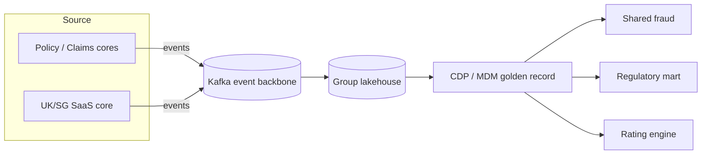

# Data Architecture — TOGAF ADM Phase C.2

## Document Control

| Field | Value |
|-------|-------|
| **Document ID** | ARC-000-DATA-v1.0 |
| **Document Type** | Data Architecture |
| **Project** | Meridian P&C Insurance Group (Project MPC, MPC-insurance) |
| **Classification** | OFFICIAL |
| **Status** | DRAFT |
| **Version** | 1.0 |
| **Created Date** | 2026-09-15 |
| **Last Modified** | 2026-09-15 |
| **Review Cycle** | Monthly during active ADM cycle |
| **Next Review Date** | 2026-10-15 |
| **Owner** | K. Whitfield, CIO / Enterprise Architecture Lead |
| **Reviewed By** | PENDING |
| **Approved By** | PENDING |
| **Distribution** | Data & Analytics team, Data Governance Council, Security & Privacy |

### Revision History

| Version | Date | Author | Changes | Approved By | Approval Date |
|---------|------|--------|---------|-------------|---------------|
| 1.0 | 2026-09-15 | ArcKit AI | Initial creation from `/arckit:data-architecture` (case-study prefill) | PENDING | PENDING |

---

## 1. Data Architecture Vision

The target data architecture establishes a **group data fabric**: one trusted
policyholder record, a group lakehouse with data contracts, and a governance
council that owns classification, lineage and privacy. Country data silos are
consolidated into a single lakehouse; policyholder identity is resolved centrally
(≥ 95% match) so that claims, pricing and regulatory reporting all draw from
authoritative golden records. Data is a governed, event-streamed asset, not a
batch by-product.

## 2. Data Entities Catalog

| Domain | Entity | Sensitivity | Classification | Owner |
|--------|--------|-------------|----------------|-------|
| Policyholder | Policyholder (golden record) | High | Confidential (PII) | Data Gov Council |
| Policyholder | Identity Resolution Record | High | Confidential (PII) | CDP team |
| Policy | Policy | Medium | Internal | Product IT |
| Policy | Endorsement | Low | Internal | Product IT |
| Claim | Claim | High | Confidential (PII) | Claims IT |
| Claim | Fraud Signal | High | Restricted | Shared Fraud |
| Product | Product / Rate Card | Medium | Internal | Actuarial |
| Underwriter | Underwriter Decision | Low | Internal | Product IT |
| Reinsurance | Treaty / Cession | High | Restricted | Reinsurance |
| Financial | General Ledger | High | Critical | Finance |
| Regulatory | Regulatory Filing | High | Restricted | Finance |
| Financial | Reserving | High | Restricted | Chief Actuary |

## 3. Data Governance Framework

| Element | Definition |
|---------|-----------|
| Stewardship model | Group data governance council + domain stewards (RACI per domain) |
| Data quality standards | Completeness ≥ 99%, accuracy target ≥ 95%, timeliness per SLO |
| Classification scheme | Public / Internal / Confidential (PII) / Restricted / Critical |
| Retention policy | Per-class legal hold & archival; PII erasure automated via CDP |
| Governance body | Council with escalation to CRO for Restricted/Critical classes |

## 4. Data Management Strategy

| Aspect | Strategy |
|--------|----------|
| Lifecycle | Create → store (lakehouse) → process (event) → archive → destroy (WORM) |
| Integration patterns | Event-driven (pub/sub) for lifecycle; REST for sync reads; file only to regulators |
| Data flow | Source cores → Kafka topics → lakehouse → CDP/MDM golden records → consumers |
| Platform strategy | Group lakehouse (cloud) + schema registry; country lakes merged |
| MDM | Golden policyholder record; matching ≥ 95% resolution |

## 5. Reference & Master Data

- **Golden records**: Policyholder, Product, Underwriter, Repair Vendor, Location.
- **Shared definitions**: standard data types, country/currency/status code sets (9 reference domains).
- **Data dictionary**: standardised field names, types, formats per domain.

## 6. Data Architecture Principles

| # | Principle | Data implication |
|---|-----------|------------------|
| 1 | Data is a governed asset | Every entity has a steward + classification |
| 2 | One trusted customer view | Golden policyholder record; identity resolution central |
| 3 | Privacy by design | PII/Restricted handling; automated erasure; residency controls |
| 4 | Event-first data movement | Pub/sub replaces batch; lineage via lakehouse |

## 7. Data Domain Map



## 8. Traceability

| Data element | Source | Link |
|--------------|--------|------|
| Capability data needs | BPCM | `ARC-000-BPCM-v1.0.md` |
| Data-producing apps | APP | `ARC-000-APP-v1.0.md` |
| Data principles | PRIN | `ARC-000-PRIN-v1.0.md` |

---

**Generated by**: ArcKit `/arckit:data-architecture` command
**Generated on**: 2026-09-15
**ArcKit Version**: 6.9.0
**Project**: Meridian P&C Insurance Group — API-First Insurance Modernisation (Project MPC, MPC-insurance)
**AI Model**: Codex via the ArcKit Codex extension v6.9.0
**Generation Context**: Synthesised from case-study/01-insurance.md §2 data assets + §3 target data architecture. No external documents.

## PlantUML ArchiMate View

**Layer focus**: Application / Technology data objects

> Notation: PlantUML ArchiMate standard library — pinned `!include <archimate/Archimate>` (PlantUML 1.2026.8).
> This view is additive; the Mermaid diagram(s) above are unchanged.

```plantuml
@startuml
!include <archimate/Archimate>

title Data Landscape — Meridian (data objects & flows)

LAYOUT_TOP_DOWN()

' Application data objects (the golden + shared records)
Application_DataObject(CDPDO, "Policyholder golden record (CDP/MDM)")
Application_DataObject(CLAIMDO, "Claim & fraud signal")
Application_DataObject(REGDO, "Regulatory filing record")

' Application components that produce/consume
Application_Component(LAKE, "Group lakehouse")
Application_Component(CDP, "CDP / MDM service")

' Relationships (serving / flow, concrete -> abstract)
Rel_Flow(CDPDO, CDP)
Rel_Flow(CLAIMDO, CDP)
Rel_Flow(REGDO, CDP)
Rel_Serving(LAKE, CDP)

@enduml
```


*Rendered offline from `./diagrams/ARC-000-DATA.puml` (local ArchiMate stdlib at `./diagrams/stdlib/`). The block above is the canonical `!include <archimate/Archimate>` and renders in any PlantUML server. Re-render: `java -jar plantuml.jar -tsvg ./diagrams/ARC-000-DATA.puml`.*
