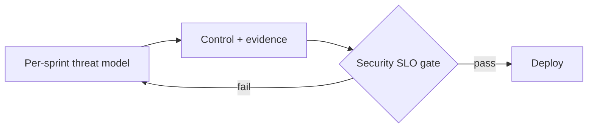

# Agile Security — Embedded Security Pillars

## Document Control

| Field | Value |
|-------|-------|
| **Document ID** | ARC-000-OASEC-v1.0 |
| **Document Type** | Agile Security |
| **Project** | Meridian P&C Insurance Group (Project MPC, MPC-insurance) |
| **Classification** | OFFICIAL |
| **Status** | DRAFT |
| **Version** | 1.0 |
| **Created Date** | 2026-09-15 |
| **Last Modified** | 2026-09-15 |
| **Review Cycle** | Quarterly |
| **Next Review Date** | 2026-10-15 |
| **Owner** | K. Whitfield, CIO / Enterprise Architecture Lead |
| **Reviewed By** | PENDING |
| **Approved By** | PENDING |
| **Distribution** | Security & Privacy Officer, SRE, squad security engineers |

### Revision History

| Version | Date | Author | Changes | Approved By | Approval Date |
|---------|------|--------|---------|-------------|---------------|
| 1.0 | 2026-09-15 | ArcKit AI | Initial creation from `/arckit:agile-security` (case-study prefill) | PENDING | PENDING |

---

## 1. Security Backlog Integration

Security is a first-class backlog item, not a bolt-on. Each sprint carries
security items (threat-model deltas, zero-trust wiring, secrets management,
AI data classification) alongside feature work.

## 2. Four Pillars (G216)

| Pillar | Meridian application |
|--------|----------------------|
| Secure by design | API-first + zero-trust from Wave 1 |
| Continuous threat modelling | Per-sprint threat model update |
| Compliance evidence per sprint | Automated control evidence |
| Security in SLO | p95 latency + availability targets monitored |

## 3. Threat Modeling per Sprint

| Sprint | Top threat | Mitigation |
|--------|-----------|------------|
| Sprint 1 | AI data pipeline unclassified | Classify before ingest |
| Sprint 2 | On-prem app without MFA | Zero-trust + IdP MFA |
| Sprint 3 | Cross-border data flow | Residency controls (PDPA/GDPR/NZ) |

## 4. Security Architecture Guardrails

| Guardrail | Enforcement |
|-----------|-------------|
| No secrets in repo | Group secrets mgmt |
| MFA on all apps | IdP policy |
| AI pipeline classified | MLOps gate |

## 5. AI/ML Security Considerations

| Concern | Control |
|---------|---------|
| Model weights (Restricted) | Access-controlled model registry |
| Prompt/data exfiltration | Egress controls + audit |
| Unaudited AI decisions | Human-in-loop + decision log |

## 6. Metrics

| Metric | Target |
|--------|--------|
| Mean time to patch critical | < 24h |
| AI decisions audited | 100% |
| Open critical security gaps | 0 |



---

**Generated by**: ArcKit `/arckit:agile-security` command
**Generated on**: 2026-09-15
**ArcKit Version**: 6.9.0
**Project**: Meridian P&C Insurance Group — API-First Insurance Modernisation (Project MPC, MPC-insurance)
**AI Model**: Codex via the ArcKit Codex extension v6.9.0
**Generation Context**: Synthesised from case-study/01-insurance.md §2 security current state + gaps. No external documents.

## PlantUML ArchiMate View

**Layer focus**: Technology / Application (security controls)

> Notation: PlantUML ArchiMate standard library — pinned `!include <archimate/Archimate>` (PlantUML 1.2026.8).
> This view is additive; the Mermaid diagram(s) above are unchanged.

```plantuml
@startuml
!include <archimate/Archimate>

title Agile Security — Meridian (security controls)

LAYOUT_TOP_DOWN()

Technology_Node(IDP, "Group IdP (MFA)")
Technology_Node(SECRETS, "Group secrets management")
Technology_Node(MREG, "Model registry (Restricted)")
Technology_SystemSoftware(ZEROTRUST, "Zero-trust enforcement")

Rel_Serving(IDP, ZEROTRUST)
Rel_Serving(SECRETS, ZEROTRUST)
Rel_Serving(MREG, ZEROTRUST)

@enduml
```


*Rendered offline from `./diagrams/ARC-000-OASEC.puml` (local ArchiMate stdlib at `./diagrams/stdlib/`). The block above is the canonical `!include <archimate/Archimate>` and renders in any PlantUML server. Re-render: `java -jar plantuml.jar -tsvg ./diagrams/ARC-000-OASEC.puml`.*
